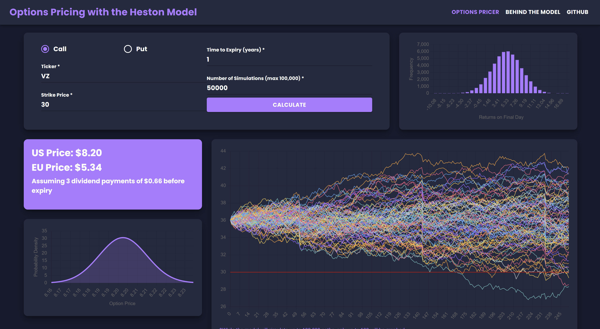

## Options Pricing Overview
A full stack application that utilizes the Heston Model and Longstaff Schwartz approach to price American and European Options

Access the site at https://www.optionspricerapp.com/



## Setup & Deployment

### Prerequisites
- Python 3.11
- Node.js (for frontend)
- API keys from:
  - [Alpha Vantage](https://www.alphavantage.co/support/#api-key) (for dividend data)
  - [Twelve Data](https://twelvedata.com/) (for stock price data)

### Environment Variables
Create a `.env` file in the `backend/` directory with the following variables:

```bash
# Required API Keys
ALPHAVANTAGE_API_KEY=your_alphavantage_api_key_here
TWELVE_API_KEY=your_twelve_data_api_key_here

# Optional Supabase Configuration (has defaults)
SUPABASE_URL=https://your-project.supabase.co
SUPABASE_KEY=your_supabase_anon_key_here
```

**Quick Setup**: Run the setup script to create your `.env` file:
```bash
cd backend
python setup_env.py
```

### Installation
1. Clone the repository
2. Install backend dependencies:
   ```bash
   cd backend
   pip install -r ../requirements.txt
   ```
3. Install frontend dependencies:
   ```bash
   cd web
   npm install
   ```

### Running Locally

1. **Set up environment variables** (first time only):
   ```bash
   cd backend
   python setup_env.py
   ```

2. **Start the backend server**:
   ```bash
   cd backend
   python server.py
   ```
   The server will start on http://localhost:5000

3. **Start the frontend** (in a new terminal):
   ```bash
   cd web
   npm start
   ```
   The React app will start on http://localhost:3000

4. **Test the pricing logic** (optional):
   ```bash
   cd backend
   python test_pricing.py
   ```

**Note**: The frontend will automatically connect to the backend API at http://localhost:5000

## Usage
In the top left of the application there is a form where users first enter a stock ticker they would like to price an option on. Other parameters (Strike price, time-to-expiry, number of simulations) are selected in the same form. When the parameters are selected, the "Calculate" button is used to begin calculating Options Price.
Upon calculation, the application visualizes a sample of 100 of the user's simulated paths, the standard error for American Prices, and a distribution of the returns on the final day.

## Built With
* <a href="https://reactjs.org/"></a>
* <a href="https://flask.palletsprojects.com/en/3.0.x/"></a>

## Credits
<ul>
   <li>
      <b>Christian Lindler</b>
      <a href="https://www.linkedin.com/in/christianlindler"></a>
      <a href="https://github.com/ChristianLindler"></a>
      <a href="mailto:ChristianWLindler@gmail.com"></a>
   </li>
   <li>
      <b>
         Ben DiPrete
      </b>
   </li>
   <li>
      <b>
         Cole Miller
      </b>
   </li>
</ul>
